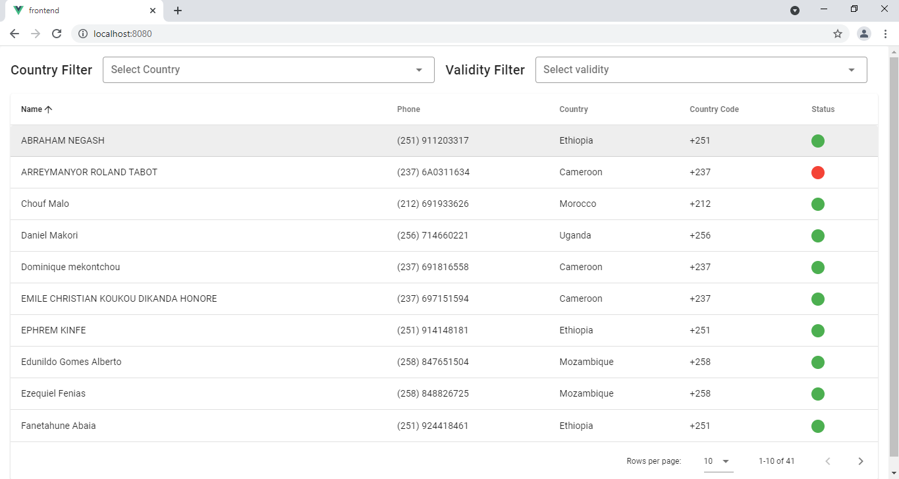
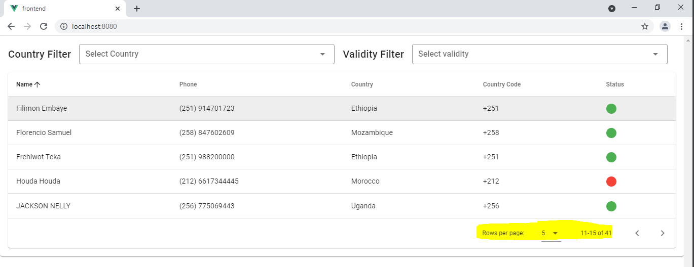
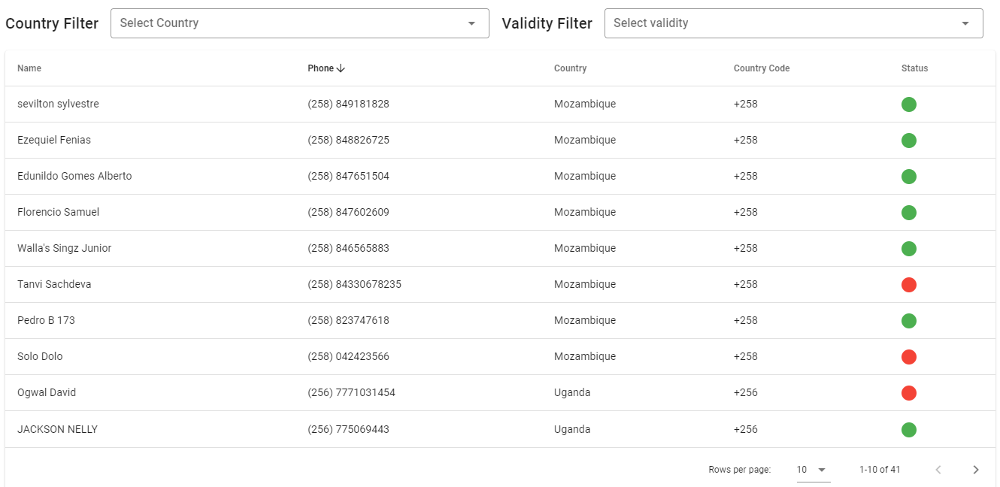
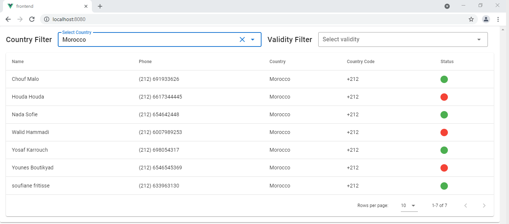
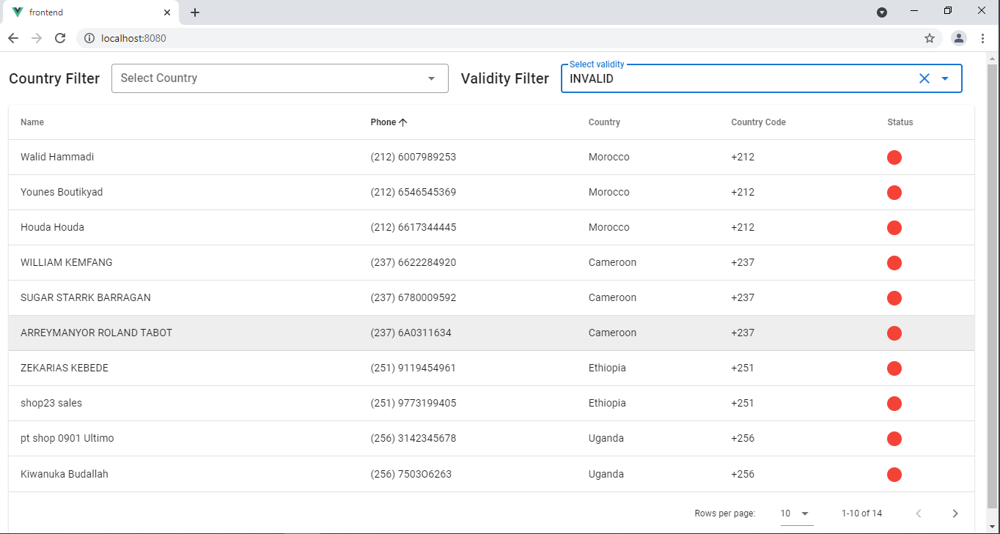
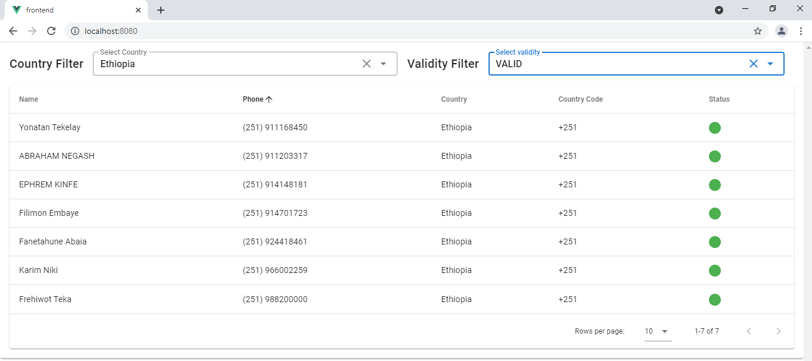

# Customers phone validating app

This a spring boot application that uses the provided database (SQLite 3) to list and categorize phone numbers.
## Technologies & Frameworks used for development

* Front end: Vue & Vuetify material.
* Back-end: Spring Boot.

## Version info

Front End
* Vue: 4.2.2
* Node: v10.15.0
* Npm: 6.14.3

Back End
* JDK: 1.8
* Spring boot: 2.5.5
* Maven: 3.8.2
* SQLite: 3.36.0
* SQLite Dialect: 0.1.2
* JUnit: 5.7.2 (For unit tests)
* Lombok: 1.18.20 (for generating getters & setters)
## Task requirements

Given some defined countries with code & valid matching regex for each & required a single-page web app to display a list of customers phone numbers, 
Phones has to be categorized by matching country, country code & validity status   

* Implement Filtering by phone number validity, country, or both combined.
* Implement Pagination & Sorting (name & phone) (using server-side).
* Unit test for services & controllers.

## Available data

* An SQLite database file "sample.db" containing a "customer" table with the columns " id, name & phone".
* A set of hardcoded  countries names, countries code &  rules/regex for valid phone country.

## Project structure

* frontend (client-side):
    * Vue component mapping for customers table located at "src/components/Customer.vue"
    * A script file containing the calls of server-side at "src/service/apiService" used by the view file
    * Error handler ( using axios interceptors) for catching the error at requesting errors from the server & log them to the console

* main (server-side):
    * java:
        * controller : has the customer controller that receives request from front-end
        * dao/repository: hase the Dao that retrieves data from SQLite database file
        * entites: has the customer table entity
        * models: has the view models which are used at the responding front-end calls (filter)
        * services: has the service which attach the controller with dao & the mapper that map the 
         entity to view Model
    * resources:
        * property file for configuring the spring datasource 
        * JSON file containing the hard coded  countries, code & rules

* test:
    * controller test
    * service test
       

## Aditional frameworks used to enhance coding style and cleanliness

* Lombok (for getter & setter generation).
* commons-lang3 (For Strings manipulations).

## Enhancement plan for existing code

* Security & validation enhancements.
* Use validation filtering at database retrieval (by trying to overwrite QueryBuilder used to support the regex keyword).
* Add search feature at the front-end.
* Add logback.xml file

## How to run the project
### Command Line
 1. Go to project root folder
 2. Compile & generate the JAR file : <code>mvn clean package</code>
 3. Run the generated JAR file : <code>java -jar target/jumia-services-0.0.1-SNAPSHOT.jar</code>
 4. Access the localhost url [http://localhost:8080]
### Docker
 1. Go to project root folder
 2. Build docker image :  <code>docker build -t customer .</code>
 3. Run the created image on port 8080 : <code>docker run -ti -p 8080:8080 customer:</code>
 4. Access the localhost url [http://localhost:8080]
### Unit tests
Run CustomerControllerTests.java
Run CustomerServiceTests.java

## Screen Shots

* Find all

* Pagination

* Sorting by Phone Number

* Filtering by Country

* Filtering by Validity

* Filtering by Country & Validity

